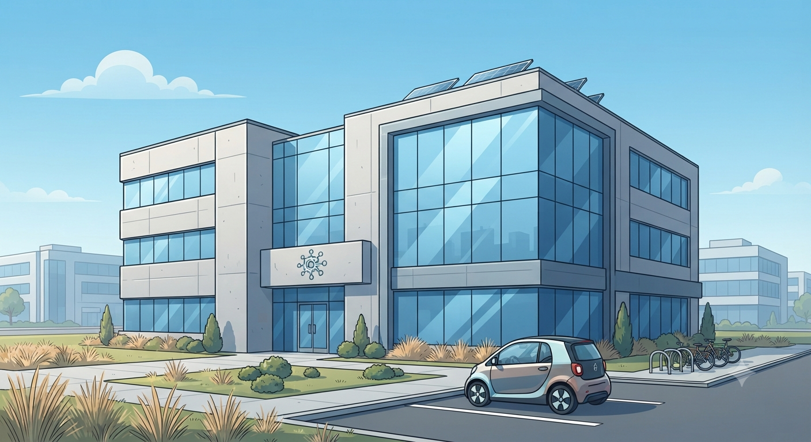
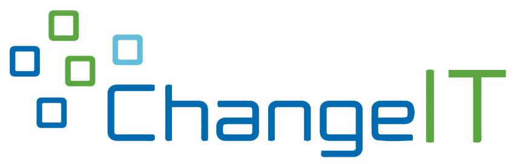
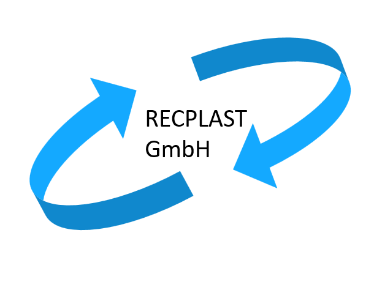

# Kapitel 1: Vorstellung der Modellunternehmen

In diesem Kapitel ...

- ... wird das Modellunternehmen, für das Sie im Lernfeld 4 arbeiten, vorgestellt.
- ... finden Sie erste Informationen zum Kunden des Modellunternehmens

## ChangeIT GmbH kennenlernen

Das IT-Systemhaus ChangeIT GmbH ist seit mehreren Jahren auf dem IT-Markt etabliert und behauptet sich dort aktuell sehr erfolgreich gegen mehrere Wettbewerber. Herr Sinter hat das Unternehmen 1997 gegründet und führt es seither alleine als eingetragener Kaufmann.

## RECPLAST GmbH kennenlernen

Die RECPLAST GmbH produziert und vertreibt etwa 400 unterschiedliche, aus Recyclingmaterialien
gefertigte Kunststoffprodukte, zum Beispiel Bauelemente wie Rund- und Brettprofile, Zäune,
Blumenkübel oder Abfallbehälter, teils in größeren Serien für Endkunden, teils spezifisch für einzelne
Geschäftskunden.

Das Auftragsvolumen, die Häufigkeit der Aufträge und die Kunden variieren: Es gibt einige wenige
Stamm- und Großkunden und zahlreiche Einzelkunden.

Der jährliche Gesamtumsatz des Unternehmens beläuft sich auf ca. 50 Millionen Euro bei einem Gewinn
von etwa einer Million Euro.

> **Hinweis:** Die RECPLAST GmbH ist ein imaginäres Unternehmen, welches das BSI (Bundesamt für Sicherheit in der Informationstechnik) für Schulungszwecke anbietet. Wir nutzen dieses auch hier im LF4-Unterricht, um einen größtmöglichen Bezug zu den Standards der Branche zu erreichen. 

