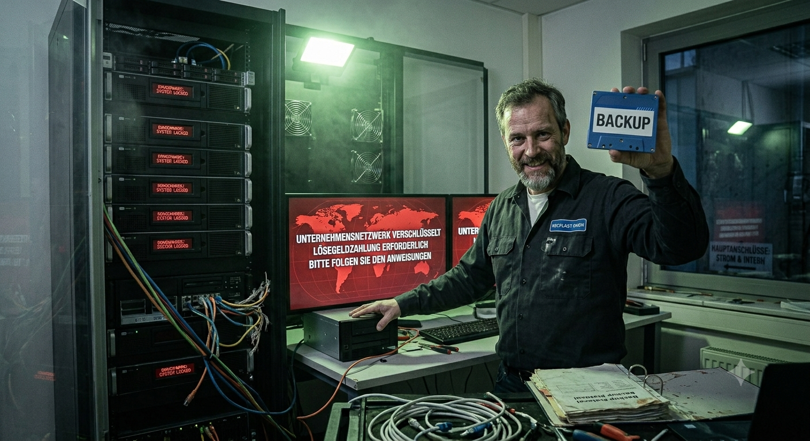

# Kapitel 2: Schutzziele der Informationssicherheit sicherstellen 

In diesem Kapitel werden Sie ...

- ... die Schutzziele der Informationssicherheit kennenlernen.
- ... in der Vertiefung Maßnahmen zur Sicherstellung der Vertraulichkeit kennenlernen.
- ... in der Vertiefung Maßnahmen zur Sicherstellung der Integrität kennenlernen.
- ... in der Vertiefung Maßnahmen zur Sicherstellung der Verfügbarkeit kennenlernen.

---

## Handlungssituation

Am Montagmorgen um 07:30 Uhr herrscht Hektik in der IT-Abteilung der RECPLAST GmbH. Die neue, vollautomatische Extrusionsanlage 4 in Werkhalle 2 sollte heute nach dreiwöchiger Testphase offiziell in den Regelbetrieb gehen.

Gegen 06:45 Uhr traten jedoch zwei gravierende Vorfälle auf:

**1. Ausfall der Steuerung (Extruder 4):**

Das zentrale Leitstand-Terminal meldet einen Verbindungsabbruch zur SPS-Steuerung von Extruder 4. Die Anlage steht still. Bei der ersten Fehlersuche stellt der Betriebstechniker fest, dass der Haupt-Switch im Hallenverteiler stromlos ist, weil das Netzteil ausgefallen ist. Ein redundantes Netzteil oder eine USV war für diesen Switch laut Dokumentation nicht vorgesehen. Die Produktionsleitung schätzt den Ausfallschaden derzeit auf ca. 12.000 € pro Stunde.

**2. Unstimmigkeiten bei den Mischungsverhältnissen:**

Parallel meldet die Qualitätskontrolle ein Problem bei Extruder 2: Die Mischungsrezeptur für die Herstellung der Recycling-Kunststoffgranulate stimmte in den letzten Nachtschicht-Protokollen nicht mit den Vorgaben des Labor-ERP-Systems überein. Der Anteil des Additivs REC-Poly-3 wurde im System von 4.5% auf 14.5% geändert. Niemand aus der Laborleitung hat diese Änderung freigegeben oder durchgeführt. Durch das falsche Mischungsverhältnis ist eine Charge von 8 Tonnen Granulat unbrauchbar geworden.

Als Sie zusammen mit Ihrer Ausbilderin, Frau Weber (CISO der RECPLAST GmbH), den Vorfall im Leitstand untersuchen, fällt Ihnen ein USB-Stick auf, der am USB-Port des Leitstand-PCs steckt. Auf dem Gehäuse steht handschriftlich "Update_Extruder_v2.4". Ein Schichtleiter erklärt: "Der Stick lag Ende letzter Woche auf dem Tisch. Ein Kollege aus der Fremdfirma für die Anlagenwartung hat gemeint, da seien die neuen Kennlinien drauf, und hat ihn kurz eingesteckt."

Zudem wird festgestellt, dass sich alle Techniker für die Bedienung der Terminals ein gemeinsames Gruppenkonto `(betrieb_halle2)` mit dem Passwort `Recplast2024!` teilen.

 <figure style="max-width: 100%; margin: 1em 0; text-align: center;"> 
 	  
 	 <figcaption style="font-size: 0.85em; color: #555555; margin-top: 6px; font-style: italic;"> 
 	 	 Abb.: Produktionshalle im Chaos (🤖 KI-generiert) 
 	 </figcaption> 
 </figure> 
 
---

## Kompetenz 2.0: Schutzziele identifizieren

Die ChangeIT GmbH wird konsultiert und Frau Weber übergibt Ihnen die Protokolle der Vorfälle und ergänzt:

*"Das ist ein Totalschaden für unsere Prozesse. Wir müssen der Geschäftsleitung bis heute Nachmittag eine erste Analyse vorlegen. Bitte arbeiten Sie die Vorfälle systematisch auf: Welche Schutzziele wurden hier verletzt, an welchen Stellen haben unsere Maßnahmen versagt und wie verhindern wir so etwas für die Zukunft?"*

 <figure style="max-width: 100%; margin: 1em 0; text-align: center;"> 
 	  
 	 <figcaption style="font-size: 0.85em; color: #555555; margin-top: 6px; font-style: italic;"> 
 	 	 Abb.: Übergabe an ChangeIT (🤖 KI-generiert) 
 	 </figcaption> 
 </figure> 

---

### Arbeitsauftrag A|2.0: CIA-Triade analysieren

#### Aufgabe 1

Analysieren Sie die Vorfälle bei Extruder 2 und 4 sowie die Bedienung der Terminals. Welche Probleme sind hier aus Sicht der Informationssicherheit aufgetreten?

#### Aufgabe 2

Erstellen Sie sich eine Übersicht der Schutzziele der Informationssicherheit mithilfe des Materials M|2.0.0: CIA-Triade. Notieren Sie sich die drei übergeordneten Schutzziele auf Deutsch und Englisch. Fertigen Sie anschließend eine Liste der Thematiken an, die dem jeweiligen Bereich zuzuordnen sind.

#### Aufgabe 3

Ordnen Sie die in Aufgabe 1 identifizierten Probleme den Schutzzielen und ggf. wenn möglich den Nachgeordneten Themenschwerpunkten zu.

---

### Informationsmaterial M|2.0.0: CIA-Triade

Die **CIA-Triade** bildet das Fundament der modernen Informationssicherheit. Das Akronym setzt sich aus den englischen Begriffen **Confidentiality**, **Integrity** und **Availability** zusammen. Diese drei Schutzziele definieren die grundlegenden Anforderungen an den sicheren Umgang mit Daten, Systemen und Prozessen in einer Organisation.

#### 1. Vertraulichkeit / Confidentiality

Das Schutzziel der **Vertraulichkeit** stellt sicher, dass Informationen nur denjenigen Personen, Systemen oder Prozessen zugänglich sind, die eine explizite Berechtigung dafür besitzen. Unbefugte Einblicke – sei es durch externe Angreifer oder nicht autorisierte interne Mitarbeiter – müssen wirksam verhindert werden. Dem Schutzziel zuzuordnen sind der Schutz sensibler Betriebsgeheimnisse, personenbezogener Daten, Finanzkennzahlen sowie der Schutz von Zugangsdaten vor unberechtigtem Zugriff.

**Aspekte, die dem Schutzziel positiv gegenüberstehen:**

* **Kryptografische Verfahren:** Der Einsatz starker Verschlüsselung für ruhende Daten (*Data at Rest*), Daten in Übertragung (*Data in Transit*) und Daten in Verarbeitung (*Data in Use*).
* **Zugriffskontrollen und Rechtemanagement:** Konsequente Anwendung des *Principle of Least Privilege* (Minimalprinzip) sowie die Implementierung von Rollen-basierten Zugriffskontrollen (RBAC).
* **Authentifizierung:** Die Pflicht zur Multi-Faktor-Authentifizierung (MFA) für alle Systemzugänge.
* **Organisatorische Maßnahmen:** Vertraulichkeitsvereinbarungen (NDAs), Klassifizierung von Dokumenten (z. B. *Öffentlich*, *Intern*, *Streng vertraulich*) sowie die Physische Zutrittskontrolle zu Rechenzentren und Leitständen.

#### 2. Integrität / Integrity

Das Schutzziel der **Integrität** garantiert die Korrektheit, Vollständigkeit und Unversehrtheit von Daten und Systemfunktionen. Es stellt sicher, dass Informationen nicht unbefugt, unbeabsichtigt oder unbemerkt verändert, gelöscht oder gefälscht werden können. Dem Schutzziel zuzuordnen sind die Zuverlässigkeit von Datensätzen (z. B. Rezepturen, Buchhaltungsdaten, Steuerungsbefehle in der Produktion), die Gültigkeit von Systemkonfigurationen sowie die Manipulationssicherheit von Übertragungskanälen.

**Aspekte, die dem Schutzziel positiv gegenüberstehen:**

* **Kryptografische Nachweise:** Verwendung von digitalen Signaturen und kryptografischen Prüfsummen (Hashwerten wie SHA-256), um Modifikationen sofort erkennbar zu machen.
* **Prozess- und Rechtekontrollen:** Implementierung des Vier-Augen-Prinzips bei kritischen Freigaben und Änderungen sowie die strikte Trennung von Entwicklungs-, Test- und Produktionsumgebungen.
* **Eingabe- und Datenvalidierung:** Automatische Plausibilitätsprüfungen in Softwareanwendungen, um fehlerhafte oder schädliche Eingaben abzufangen.
* **Revisionssichere Speicherung:** Einsatz von Write-Once-Read-Many-Speichermedien (WORM) und Versionierungssystemen zur Historisierung von Datenänderungen.

#### 3. Verfügbarkeit / Availability

Das Schutzziel der **Verfügbarkeit** gewährleistet, dass Autorisierte bei Bedarf unverzüglich und störungsfrei auf Daten, IT-Systeme und Dienstleistungen zugreifen können. Ein Ausfall von Systemen oder Netzwerken kann Geschäftsprozesse oder Produktionsstraßen vollständig lähmen. Dem Schutzziel zuzuordnen sind die Funktionsfähigkeit der IT/OT-Infrastruktur, die Aufrechterhaltung der Netzwerkkonnektivität, die Betriebsbereitschaft von Servern und Datenbanken sowie die Minimierung von ungeplanten Ausfallzeiten (Downtime).

**Aspekte, die dem Schutzziel positiv gegenüberstehen:**

* **Redundanz:** Redundante Auslegung kritischer Komponenten wie Netzteile, Festplatten (RAID), Netzwerkpfade, Server-Cluster und Rechenzentren (Single Point of Failure vermeiden).
* **Ausfallsichere Infrastruktur:** Einsatz von Unterbrechungsfreien Stromversorgungen (USV), Notstromaggregaten und redundanten Klimaanlagen in Serverräumen.
* **Datensicherung und Notfallplanung:** Regelmäßige Erstellung von Backups (z. B. nach der 3-2-1-Regel), regelmäßiges Testen der Wiederherstellung (Disaster Recovery) sowie ausgearbeitete Business-Continuity-Pläne (BCP).
* **Schutz vor Überlastung:** Implementierung von Load Balancern sowie automatisierten Schutzmechanismen gegen Denial-of-Service-Angriffe (DDoS-Protection).

---

## Kompetenz 2.1: Vertraulichkeit sicherstellen

Während Sie noch am Leitstand stehen, weist Frau Weber auf den eingesteckten USB-Stick und den Notizzettel mit dem gemeinsamen Passwort: "Dass hier jeder ungehindert reinschauen und Daten abgreifen kann, ist ein untragbarer Zustand für die Vertraulichkeit unserer Daten. Lassen Sie uns diesen Bereich jetzt gründlich durchleuchten: Welche technischen und organisatorischen Möglichkeiten haben wir überhaupt, um Vertraulichkeit herzustellen, und welche davon passen zu den Abläufen hier bei RECPLAST?"

 <figure style="max-width: 100%; margin: 1em 0; text-align: center;"> 
 	  
 	 <figcaption style="font-size: 0.85em; color: #555555; margin-top: 6px; font-style: italic;"> 
 	 	 Abb.: Alles für die Vertraulichkeit (🤖 KI-generiert) 
 	 </figcaption> 
 </figure> 

--- 

### Arbeitsauftrag A|2.1: Maßnahmen zur Vertraulichkeit kennenlernen

#### Aufgabe 1

Fassen Sie kurz in eigenen Worten zusammen, welches der Probleme in der RECPLAST GmbH den Bereich der Vertraulichkeit betrifft.

#### Aufgabe 2

Welche Maßnahmen können in einem Unternehmen ergriffen werden, um die Vertraulichkeit sicherzustellen? Informieren Sie sich in M|2.1.0: Deep Dive – Schutzziel Vertraulichkeit hierüber.

#### Aufgabe 3

Wählen Sie aus den Maßnahmen die am besten geeigneten  aus, um die Vertraulichkeit im Leitstand und an den Extrusionsanlagen der RECPLAST GmbH nachhaltig herzustellen.

Begründen Sie Ihre Auswahl gegenüber der IT-Sicherheitsbeauftragten Frau Weber:

- Warum sind genau diese Maßnahmen für die RECPLAST GmbH verhältnismäßig und realistisch?
- Welche Maßnahmen aus dem Katalog würden Sie für die Fertigungshalle eher nicht empfehlen und warum?

---

### Material M|2.1.0: Deep Dive – Schutzziel Vertraulichkeit

#### 1. Was bedeutet Vertraulichkeit?

Das Schutzziel **Vertraulichkeit** fordert, dass Informationen, Daten und IT-Systeme **ausschließlich autorisierten Personen, Prozessen oder IT-Systemen** zugänglich sind. Unbefugte – egal ob externe Angreifer oder nicht-berechtigte Kolleginnen und Kollegen im eigenen Unternehmen – dürfen keinen Einblick erhalten.

Ein Verlust der Vertraulichkeit liegt bereits dann vor, wenn vertrauliche Daten gelesen, kopiert oder offengelegt werden, ohne dass dabei zwangsläufig Daten verändert oder gelöscht werden müssen.

#### 2. Wie stellen wir Vertraulichkeit sicher?

Um Vertraulichkeit in einer modernen IT- und Produktionsumgebung (OT) durchzusetzen, kombinieren IT-Sicherheitsverantwortliche **technische und organisatorische Maßnahmen (TOMs)**.

##### A. Technische Maßnahmen

* **Verschlüsselung (Kryptografie):**
  * **Data in Transit (Übertragung):** Verschlüsselung von Netzwerkverbindungen (z. B. via TLS/HTTPS, IPsec, SSH), damit Datenpakete auf dem Leitungsweg nicht mitgeschnitten werden können.
  * **Data at Rest (Speicherung):** Festplatten- und Datenbankverschlüsselung (z. B. BitLocker, LUKS, AES-256), damit Daten bei Verlust oder Diebstahl von Datenträgern unlesbar bleiben.
  * **Data in Use (Verarbeitung):** Schutz von Daten im Arbeitsspeicher vor unbefugtem Auslesen anderer Prozesse.
* **Identitäts- und Zugriffsmanagement (IAM):**
  * **Personalisierte Accounts:** Jede Person erhält ein individuelles Benutzerkonto. Shared Accounts (gemeinsam genutzte Konten) sind strikt verboten.
  * **Starke Authentifizierung:** Einsatz von Multi-Faktor-Authentifizierung (MFA/2FA) mittels Passwörtern, Hardware-Token oder Biometrie.
  * **Rechtestrukturierung:** Rechtevergabe nach dem **Principle of Least Privilege** (Minimalprinzip) über Rollen-basierte Zugriffskontrollen (RBAC). Jede/r sieht nur das, was für die tägliche Arbeit zwingend notwendig ist (*Need-to-know-Prinzip*).
* **Netzwerksegmentierung:**
  * Trennung von Office-Netzen, Produktionsnetzen (OT/VLANs) und Gast-WLANs durch Firewalls, um unbefugte Datenströme zwischen den Segmenten zu blockieren.
* **Schnittstellen- und Endgeräteschutz (Endpoint Security):**
  * Logische Sperrung ungenutzter Ports (z. B. USB-Ports per Group Policy oder Endpoint-Protection-Software deaktivieren).

##### B. Organisatorische & Physische Maßnahmen

* **Klassifizierung von Informationen:** Einstufung von Dokumenten und Daten in Vertraulichkeitsstufen (z. B. *Öffentlich*, *Intern*, *Vertraulich*, *Streng vertraulich*) inklusive entsprechender Handhabungsvorschriften.
* **Physische Zutrittskontrollen:** Sicherung von Serverräumen, Leitständen und Archiven durch Schließanlagen, RFID-Chipkarten, Biometrie und Besucherdokumentation.
* **Betriebsvereinbarungen & Guidelines:** Verpflichtung auf das Datengeheimnis, Sicherheitsrichtlinien zur Nutzung von Wechselmedien und Clean-Desk-Policies.
* **Awareness-Schulungen:** Regelmäßige Trainings der Belegschaft gegen Social-Engineering-Angriffe (z. B. Phishing, Shoulder Surfing, Tailgating/Huckepackmitnahme).

---

### Arbeitsauftrag A|2.2: Asymmetrische und Symmetrische Verschlüsselung unterscheiden

Frau Weber blickt auf Ihren Entwurf für die OT-Infrastruktur und nickt:

*"Ein wichtiger Punkt für die Vertraulichkeit ist die Verschlüsselung. Wir müssen künftig die Übertragung der hochsensiblen Rezepturdaten vom zentralen Labor-ERP-System zu den Leitständen in Hallenverteiler 2 absichern. Wenn hier jemand im Netzwerk mithört, liegen unsere Firmengeheimnisse offen.*

*Ein Kollege schlägt vor, die Daten einfach mit einem Passwort per symmetrischer Verschlüsselung zu sichern. Ein anderer möchte lieber asymmetrische Verschlüsselung einsetzen, weil er meint, das wäre viel sicherer."*

#### Aufgabe 1

Beschreiben Sie kurz, welche Gefahr für die Vertraulichkeit besteht, wenn das Labor-ERP-System die neuen Kunststoff-Rezepturen im Klartext an die Extrusionsanlagen sendet.

#### Aufgabe 2

Erläutern Sie das grundlegende Problem des Schlüsselaustauschs (Key Distribution Problem), wenn das Labor und alle 12 Leitstände in den Hallen ausschließlich ein einziges, gemeinsames symmetrisches Passwort nutzen würden.

#### Aufgabe 3

Informieren Sie sich in den bereitgestellten Materialien über die Funktionsweisen der Kryptografie und bearbeiten Sie folgende Punkte:

- M|2.2.0: Symmetrische Verschlüsselung: Erklären Sie in eigenen Worten das Funktionsprinzip sowie die wesentlichen Vor- und Nachteile.
- M|2.2.1: Asymmetrische Verschlüsselung: Erläutern Sie das Konzept des Schlüsselpaares (Public Key und Private Key). Gehen Sie darauf ein, welcher Schlüssel zum Verschlüsseln und welcher zum Entschlüsseln genutzt wird.
- M|2.2.2: Hybride Verschlüsselung: Stellen Sie dar, wie das hybride Verfahren die Vorteile beider Ansätze kombiniert und wo es eingesetzt wird.

#### Aufgabe 4

Welches Verschlüsselungsverfahren (symmetrisch, asymmetrisch oder hybrid) empfehlen Sie Frau Weber für die automatische Übertragung der Rezepturdaten über das Firmennetzwerk?

---

### Material M|2.2.0: Symmetrische Verschlüsselung

Die symmetrische Verschlüsselung gehört zu den ältesten und grundlegendsten Verfahren der Kryptografie. Ihr zentrales Funktionsprinzip beruht auf der Verwendung eines einzigen, identischen Schlüssels (*Secret Key*) für sowohl die Ver- als auch die Entschlüsselung einer Nachricht. Wenn ein Klartext in einen unlesbaren Chiffretext umgewandelt werden soll, verarbeitet ein mathematischer Algorithmus die Ursprungsdaten zusammen mit diesem geheimen Schlüssel. Auf der Empfängerseite wird exakt derselbe Schlüssel benötigt, um den Chiffretext mithilfe des umgekehrten Algorithmus wieder in den ursprünglichen Klartext zurückzuverwandeln. Sender und Empfänger müssen somit zwingend über denselben Geheimtext-Schlüssel verfügen.

In der modernen Informationstechnik findet die symmetrische Verschlüsselung breite Anwendung, insbesondere dort, wo große Datenmengen effizient geschützt werden müssen. Typische Einsatzbereiche sind die Festplatten- und Datenverschlüsselung im Ruhezustand (*Data at Rest*), beispielsweise durch Technologien wie BitLocker unter Windows oder LUKS unter Linux. Ebenso werden symmetrische Verfahren wie der AES-Standard (*Advanced Encryption Standard*) genutzt, um die eigentlichen Nutzdaten in gesicherten Netzwerkverbindungen (z. B. bei VPN-Tunneln via IPsec oder HTTPS-Verbindungen im Web) zu übertragen.

Der größte Vorteil symmetrischer Verschlüsselungsverfahren liegt in ihrer extrem hohen Rechengeschwindigkeit und Effizienz. Da die zugrundeliegenden mathematischen Operationen vergleichsweise einfach aufgebaut sind, können selbst riesige Dateien oder kontinuierliche Datenströme in Echtzeit und ohne spürbare Verzögerung ver- und entschlüsselt werden. Zudem bieten moderne Standardverfahren wie AES bei ausreichender Schlüssellänge (z. B. 256 Bit) ein extrem hohes Sicherheitsniveau gegen Brute-Force-Angriffe.

Dem steht jedoch ein gravierender Nachteil gegenüber: das sogenannte Schlüsselverteilungsproblem (*Key Distribution Problem*). Bevor zwei Parteien vertraulich miteinander kommunizieren können, muss der geheime Schlüssel über einen absolut sicheren Kanal ausgetauscht werden. Wird der Schlüssel während der Übertragung von Dritter Seite abgefangen, ist die gesamte Vertraulichkeit kompromittiert. Zudem skaliert das Verfahren in Netzwerken schlecht: Sollen viele Parteien paarweise vertraulich miteinander kommunizieren, steigt die Anzahl der benötigten geheimen Schlüssel exponentiell an, was die Schlüsselverwaltung im Betrieb enorm erschwert.

---

### Material M|2.2.1: Asymmetrische Verschlüsselung

Die asymmetrische Verschlüsselung – auch bekannt als Public-Key-Kryptografie – löst das fundamentale Problem des sicheren Schlüsselaustauschs, indem sie ein mathematisch verknüpftes Schlüsselpaar einsetzt. Dieses Paar besteht aus einem öffentlichen Schlüssel (*Public Key*) und einem privaten Schlüssel (*Private Key*). Während der öffentliche Schlüssel gefahrlos allen Kommunikationspartnern zugänglich gemacht werden darf, muss der private Schlüssel streng geheim bleiben und darf seinen Besitzer niemals verlassen. Das zentrale Funktionsprinzip lautet: Eine Nachricht, die mit einem bestimmten öffentlichen Schlüssel verschlüsselt wurde, kann ausschließlich mit dem dazugehörigen, einzigartigen privaten Schlüssel wieder entschlüsselt werden. Ein Rückschluss vom öffentlichen auf den privaten Schlüssel ist nach heutigem Stand der Technik mathematisch praktisch unmöglich.

Eingesetzt wird die asymmetrische Verschlüsselung vorrangig überall dort, wo Partner ohne vorherigen sicheren Kontakt vertraulich miteinander kommunizieren müssen oder die Identität der Gegenseite nachgewiesen werden soll. Neben der reinen Datenverschlüsselung bildet sie das Fundament für digitale Signaturen (z.B. im E-Mail-Verkehr mit S/MIME oder PGP) sowie für digitale Zertifikate im Web. Wenn ein Browser eine sichere HTTPS-Verbindung zu einem Webserver aufbaut, wird die Identität des Anbieters über asymmetrische Zertifikate (Public Key Infrastructure, PKI) nachgewiesen und der erste Kontaktaufbau abgesichert.

Der herausragende Vorteil dieses Verfahrens liegt in der eleganten Lösung des Schlüsselverteilungsproblems. Da der öffentliche Schlüssel überall frei verteilt werden kann, entfällt die Notwendigkeit eines geheimen Kanals für den Schlüsselaustausch. Zudem skaliert das System hervorragend: Jede Komponente im Netzwerk benötigt lediglich ihr eigenes Schlüsselpaar, um vertraulich mit beliebig vielen anderen Partnern zu kommunizieren.

Hauptnachteil der asymmetrischen Verschlüsselung ist jedoch ihre sehr geringe Rechengeschwindigkeit. Die zugrundeliegenden komplexen mathematischen Operationen (wie das Faktorisieren sehr großer Primzahlen oder Berechnungen auf elliptischen Kurven) erfordern erhebliche Rechenleistung. Für das Ver- und Entschlüsseln großer Datenmengen oder kontinuierlicher Datenströme ist das Verfahren daher viel zu langsam und im Betriebsalltag unpraktikabel.

---

### Material M|2.2.2: Hybride Verschlüsselung

Die hybride Verschlüsselung vereint die spezifischen Stärken der symmetrischen und der asymmetrischen Verschlüsselung in einem gemeinsamen Verfahren. Sie löst damit das grundlegende Dilemma der modernen Kryptografie: die Wahl zwischen der hohen Rechengeschwindigkeit symmetrischer Algorithmen und dem komfortablen, sicheren Schlüsselaustausch asymmetrischer Verfahren. Das Funktionsprinzip teilt den Verschlüsselungsprozess in zwei Schritte auf. Für die eigentliche Nachricht wird zunächst ein einmaliger, zufällig generierter symmetrischer Schlüssel erzeugt – der sogenannte Sitzungsschlüssel (*Session Key*). Die eigentlichen Nutzdaten werden mit diesem Sitzungsschlüssel extrem schnell symmetrisch verschlüsselt. Anschließend wird der Sitzungsschlüssel selbst mit dem öffentlichen Schlüssel (*Public Key*) des Empfängers asymmetrisch verschlüsselt. Beide Teile – der symmetrisch verschlüsselte Text und der asymmetrisch verschlüsselte Sitzungsschlüssel – werden zusammen an den Empfänger übertragen.

Der Empfänger nutzt nach dem Empfang seinen eigenen privaten Schlüssel (*Private Key*), um den Sitzungsschlüssel zu entschlüsseln. Mit dem so gewonnenen Klartext-Sitzungsschlüssel kann er im nächsten Schritt die eigentliche Nachricht blitzschnell symmetrisch entschlüsseln. Durch diese Kombination entfällt die Notwendigkeit, vorab einen geheimen Schlüssel über einen unsicheren Kanal auszutauschen, während gleichzeitig die hohe Verarbeitungsgeschwindigkeit für große Datenmengen erhalten bleibt.

In der Praxis ist die hybride Verschlüsselung der weltweite Standard für fast alle modernen Kommunikationsprotokolle. Sie bildet das Rückgrat der Transport Layer Security (TLS/SSL) bei HTTPS-Verbindungen im Internet, sichert den Datenaustausch in Virtual Private Networks (VPNs) ab und kommt bei der verschlüsselten E-Mail-Übertragung (z.B. via S/MIME oder PGP) sowie bei sicheren SSH-Verbindungen zur Serververwaltung zum Einsatz.

Der entscheidende Vorteil dieses Verfahrens ist die optimale Kombination aus Effizienz und Sicherheit. Selbst riesige Datenmengen oder kontinuierliche Datenströme können ohne spürbare Performance-Einbußen geschützt werden, während das Schlüsselverteilungsproblem vollständig gelöst ist. Als einziger relativer Nachteil kann der leicht erhöhte organisatorische und technische Systemaufwand genannt werden, da beide Verschlüsselungsarten implementiert und eine geeignete Infrastruktur zur Verwaltung der öffentlichen Schlüssel (PKI) bereitgestellt werden muss.

---

### Arbeitsauftrag A|2.3: Multi-Faktor-Authentifizierung durchführen

Frau Weber ruft Sie an ihren Bildschirm im IT-Büro: 

"Wir haben den Vorfall in Werkhalle 2 weiter analysiert. Dass sich alle Techniker das Sammelkonto betrieb_halle2 mit dem Passwort Recplast2024! teilen, war ein offenes Scheunentor für den unbefugten Zugriff. Jeder, der den Zettel am Leitstand liest, kann sich als Hallenpersonal ausgeben. Wir müssen auf individuelle Benutzerkonten umstellen. Aber ein einfaches Passwort reicht mir für den Zugriff auf die Steuerungsterminals nicht mehr aus – Passwörter werden aufgeschrieben, erraten oder weitergegeben. Wir müssen eine Multi-Faktor-Authentifizierung (MFA) einführen. Vor allem für den Schnellzugriff an den Terminals in der Fertigung und den Remote-Zugriff der externen Wartungstechniker müssen wir entscheiden, wie wir die drei Kategorien der Authentifizierung sinnvoll kombinieren."

#### Aufgabe 1

Erläutern Sie, warum die bisherige Authentifizierung über das alleinige Passwort `Recplast2024!` am Leitstand das Schutzziel Vertraulichkeit (sowie die Zurechenbarkeit) verletzt.

#### Aufgabe 2

Beschreiben Sie das fundamentale Sicherheitsrisiko, wenn sich ein Authentifizierungsverfahren ausschließlich auf den Faktor Wissen (also das Passwort wissen) stützt.

#### Aufgabe 3

Informieren Sie sich in den bereitgestellten Materialien über die drei Kategorien der Authentifizierung und bearbeiten Sie folgende Punkte:

- M|2.3.0: Faktor Wissen (Passwörter und Geheimnisse): Erklären Sie das Funktionsprinzip dieser Kategorie. Beschreiben Sie, welche Kriterien ein sicheres Passwort erfüllen muss und warum Hashfunktionen bei der Speicherung auf Servern eingesetzt werden.
- Material M|2.3.1: Faktor Besitz (Hardware-Token, TOTP und Passkeys): Erläutern Sie das Prinzip des Besitz-Nachweises. Stellen Sie die Funktionsweisen von physischen Token (z. B. RFID-Chips/Hardware-Keys) sowie den logischen Verfahren TOTP (zeitbasierte Einmalpasswörter) und Passkey (FIDO2/WebAuthn) dar.
- Material M|2.3.2: Faktor Biometrie / Inhärenz (Körperliche Merkmale): Erklären Sie, wie die Identifikation über körperliche Merkmale funktioniert. Nennen Sie die wesentlichen Vorteile und Risiken.

#### Aufgabe 4

Definieren Sie kurz, ab wann eine Anmeldung formal als Multi-Faktor-Authentifizierung (MFA) bzw. Zwei-Faktor-Authentifizierung (2FA) gilt.

#### Aufgabe 5

Kommen Sie zurück auf die Bedienung der Leitstände in Werkhalle 2 sowie den Remote-Zugriff der externen Wartungsfirma:

- Szenario A (Leitstand in der Fertigungshalle): Wählen Sie eine geeignete Kombination aus zwei Faktoren (aus Wissen, Besitz oder Biometrie) für die Schichtarbeiter direkt an den Extrusionsanlagen. Begründen Sie Ihre Wahl im Hinblick auf Praxistauglichkeit (z. B. Arbeiten mit Handschuhen, schnelle Anmeldung) und Sicherheit.
- Szenario B (Remote-Zugriff der Wartungsfirma): Welches MFA-Verfahren empfehlen Sie für den externen Fernzugriff von Wartungstechnikern der ChangeIT GmbH auf die Steuerungssysteme der RECPLAST GmbH?

Begründen Sie Ihre Entscheidungen.

---

### Material M|2.3.0: Faktor Wissen (Passwörter und Geheimnisse)

Die Authentifizierung über den Faktor Wissen ist das historisch älteste und am weitesten verbreitete Verfahren zur Identitätsprüfung in der IT. Das Grundprinzip ist simpel: Ein Benutzer beweist seine Identität gegenüber einem System, indem er eine Information angibt, die theoretisch nur ihm allein bekannt sein sollte. Die typischsten Vertreter dieser Kategorie sind Passwörter, Passphrasen, PINs (Personal Identification Numbers) oder Antworten auf Sicherheitsfragen. Da der Server die eingegebene Information mit dem hinterlegten Soll-Wert vergleicht, findet bei erfolgreicher Übereinstimmung der Zugriff statt.

In der Unternehmenspraxis stellt der Faktor Wissen jedoch eine der größten Schwachstellen für die Vertraulichkeit dar. Passwörter werden von Nutzern häufig zu kurz gewählt, für mehrere Dienste wiederverwendet, auf Notizzettel geschrieben oder fallen Social-Engineering-Angriffen (wie Phishing) zum Opfer. Ein sicheres Passwort sollte daher eine ausreichende Länge (mindestens 12 bis 16 Zeichen) aufweisen und eine Kombination aus Groß- und Kleinbuchstaben, Zahlen sowie Sonderzeichen enthalten. Noch sicherer sind sogenannte Passphrasen – lange, leicht merkbare Satzkonstruktionen.

Um das Risiko von gestohlenen oder erratenen Kennwörtern zu minimieren, dürfen Passwörter auf Servern niemals im Klartext gespeichert werden. Stattdessen werden sie mithilfe kryptografischer Einwegfunktionen (Hashfunktionen wie bcrypt oder Argon2) unter Beigabe eines zufälligen Werts (Salt) verarbeitet. Der größte systematische Nachteil des Faktors Wissen bleibt jedoch bestehen: Sobald eine andere Person das Geheimnis erfährt – sei es durch Blicke über die Schulter (Shoulder Surfing), Datenlecks oder Schwachstellen im System – kann sie sich ohne jegliche Hürde für den rechtmäßigen Nutzer ausgeben.

---

### Material M|2.3.1: Faktor Besitz (Hardware-Token, TOTP und Passkeys)

Der Faktor Besitz basiert darauf, dass der Benutzer seine Identität durch den physikalischen oder logischen Nachweis eines Gegenstandes belegt, den nur er besitzt. Das Funktionsprinzip verlangt, dass der Benutzer Zugriff auf dieses spezifische Objekt hat, um eine Authentifizierung erfolgreich abzuschließen. Klassische physische Beispiele hierfür sind RFID-Chipkarten für Schließsysteme, USB-Hardware-Token (z. B. YubiKeys) oder Chipkartenleser.

In der modernen IT-Sicherheit haben sich vor allem zwei possession-basierte Verfahren etabliert:

- **Time-based One-time Password (TOTP):** Hierbei generiert eine App auf einem registrierten Gerät (z. B. Smartphone) alle 30 bis 60 Sekunden einen neuen, einmalig gültigen 6-stelligen Code. Dies geschieht auf Basis eines gemeinsamen Geheimnisses (Shared Secret) und der exakten Uhrzeit. Der Code beweist, dass der Nutzer das registrierte Gerät aktuell besitzt.
- **Passkey:** Dies ist ein hochmoderner Standard (FIDO2/WebAuthn), der das klassische Passwort vollständig ersetzt. Das Gerät des Nutzers (z. B. Smartphone, Laptop oder Security-Key) speichert einen eindeutigen privaten Schlüssel (Private Key). Bei der Anmeldung fordert der Server das Gerät auf, eine Challenge kryptografisch zu signieren. Der Nachweis erfolgt ausschließlich über den Besitz dieses kryptografischen Schlüssels auf dem physikalischen Gerät.

Der entscheidende Vorteil des Faktors Besitz liegt in seiner Resistenz gegen reine Online-Passwort-Diebstähle oder Phishing-Angriffe (insbesondere bei FIDO2/Passkeys). Ein Angreifer, der lediglich ein Passwort kennt, kann sich ohne das physische Gerät nicht anmelden. Ein Nachteil besteht im logistischen Aufwand: Geht der Gegenstand verloren, beschädigt oder wird das Smartphone gestohlen, sind strukturierte Wiederherstellungsprozesse (Recovery-Prozesse) erforderlich, um den Nutzer nicht dauerhaft auszusperren.

---

### Material M|2.3.2: Faktor Biometrie / Inhärenz (Körperliche Merkmale)

Der Faktor Biometrie (auch als Inhärenz bezeichnet) nutzt unverwechselbare, körperliche oder verhaltensbedingte Eigenschaften eines Menschen zur Authentifizierung. Das zugrundeliegende Prinzip lautet: Der Benutzer weist nach, wer er ist. Da biometrische Merkmale fest mit der Person verbunden sind, können sie im Gegensatz zu Passwörtern nicht vergessen und im Gegensatz zu Hardware-Token nicht zu Hause liegen gelassen werden. Zu den am häufigsten genutzten biometrischen Verfahren gehören der Fingerabdruckscan, die Gesichtserkennung (Face ID), der Iris-Scan sowie die Venenerkennung.

Eingesetzt wird die Biometrie heute flächendeckend bei der Freischaltung von mobilen Endgeräten (Smartphones, Tablets), an modernen Zutrittskontrollsystemen für Sicherheitsbereiche (z. B. Rechenzentren) sowie als lokaler Freigabemechanismus bei Passkey-Anmeldungen. Die Sensoren erfassen die biologischen Daten, wandeln sie in ein mathematisches Muster (Template) um und vergleichen dieses mit dem lokal abgespeicherten Referenzmuster.

Der größte Vorteil der Biometrie liegt in der hervorragenden Benutzerfreundlichkeit und Schnelligkeit. Die Freigabe erfolgt in Sekundenbruchteilen, ohne dass sich der Nutzer komplexe Zeichenfolgen merken muss. Zudem ist eine Weitergabe der Zugangsdaten an Kollegen (z. B. im Schichtbetrieb) nahezu ausgeschlossen.

Dennoch birgt die Biometrie spezifische Nachteile und Risiken: Ein biometrisches Merkmal ist niemals geheim – Fingerabdrücke werden auf Oberflächen hinterlassen und Gesichter sind öffentlich sichtbar. Wird ein biometrischer Datensatz einmal kompromittiert oder nachgebildet (z. B. durch hochauflösende Attrappen), kann das Merkmal im Gegensatz zu einem Passwort niemals geändert werden – ein Mensch hat schließlich nur einen Satz Fingerabdrücke. Zudem müssen bei der Speicherung und Verarbeitung biometrischer Daten strengste Datenschutzanforderungen eingehalten werden.

---

### Arbeitsauftrag A|2.4: Benutzer und Rechtevergabe planen

Nachdem Sie gemeinsam mit Frau Weber die Multi-Faktor-Authentifizierung (MFA) für die Terminals in Werkhalle 2 geplant haben, steht der nächste Schritt an: Das gemeinsame Sammelkonto betrieb_halle2 muss endgültig gelöscht und durch ein strukturiertes, individuelles Benutzermanagement ersetzt werden.

Frau Weber erklärt das Ziel der Maßnahme:

*"MFA nützt uns nichts, wenn am Ende zwar jeder Techniker sein eigenes Login hat, aber alle dieselben Vollzugriffsrechte besitzen. Letzte Woche hat ein Azubi aus Versehen die Extruder-Temperatureinstellungen einer Anlage im System überschrieben – einfach, weil sein Account dieselben Rechte hatte wie der des Fertigungsleiters. Wir brauchen ein klares Rechtekonto-Konzept: Jeder Mitarbeiter darf nur genau das tun und sehen, was er für seine tägliche Arbeit wirklich braucht. Zudem können wir nicht für jeden einzelnen Mitarbeiter händisch Rechte vergeben und pflegen – bei Personalwechseln blickt sonst keiner mehr durch. Wir müssen Rollen definieren und Berechtigungen über Gruppen steuern."*

#### Aufgabe 1

Erläutern Sie, welche Risiken entstehen, wenn allen Benutzern im Unternehmen standardmäßig administrative Schreib- oder Konfigurationsrechte eingeräumt werden.

#### Aufgabe 2

Informieren Sie sich im M|2.4.0: Principle of Least Privilege und erklären Sie das Principle of Least Privilege (Prinzip der minimalen Rechtevergabe). Begründen Sie, warum dieses Prinzip für das Schutzziel der Integrität und Vertraulichkeit bei RECPLAST essenziell ist.

#### Aufgabe 3

Arbeiten Sie anhand des M|2.4.1: Berechtigungen und Gruppen folgende Grundlagen heraus:

- Benutzerverwaltung vs. Rechtesteuerung: Unterscheiden Sie zwischen der Identität eines Benutzers (User Account) und seinen Berechtigungen (Permissions).
- Rollenbasierte Zugriffskontrolle (RBAC - Role-Based Access Control):
  - Erklären Sie das Funktionsprinzip von RBAC (Zuordnung von Benutzern zu Gruppen/Rollen und Rollen zu Berechtigungen).
  - Welche administrativen Vorteile bietet RBAC gegenüber der direkten Zuweisung von Rechten an einzelne Personen (z. B. bei Neueinstellungen, Abteilungswechseln oder Kündigungen)?
- Rechte-Arten: Differenzieren Sie kurz zwischen Lese- (Read), Schreib- (Write), Ausführ- (Execute) und Administrationsrechten im Kontext von Anwendungs- und Dateisystemzugriffen.

#### Aufgabe 4

In Werkhalle 2 arbeiten verschiedene Personengruppen an den Steuerungsterminals. Erstellen Sie ein Berechtigungskonzept nach dem RBAC-Prinzip für folgende Rollen:

- Maschinenbediener / Techniker (Schichtbetrieb)
- Fertigungsleitung / Schichtführer
- Auszubildende / Praktikanten
- Externe Wartungs-Techniker

Erstellen Sie eine Übersicht (z.B. als Berechtigungsmatrix), aus der hervorgeht:

- Welche Rolle welche Lese-, Schreib- oder Sonderrechte auf die Anlagensteuerung und Rezepturdatenbank besitzt. Sie können die Kürzel (r=read, w=write, x=execute) verwenden.
- Wie Sie das Principle of Least Privilege speziell für die Gruppe der Auszubildenden und der externen Wartungstechniker umsetzen?

---

### Material M|2.4.0: Principle of Least Privilege

Das Principle of Least Privilege (PoLP) – im Deutschen auch als Prinzip der minimalen Rechtevergabe oder Minimalprinzip bezeichnet – ist eines der wichtigsten Grundprinzipien der Informationssicherheit. Das Prinzip besagt, dass jeder Benutzer, jeder Prozess und jedes IT-System nur exakt diejenigen Zugriffsrechte und Befugnisse erhalten darf, die für die ordnungsgemäße Erfüllung der jeweiligen spezifischen Aufgabe zwingend erforderlich sind. Jegliche darüber hinausgehenden Rechte sind konsequent zu verweigern (Default Deny).

In vielen Unternehmensnetzwerken herrscht in der Praxis das Antipattern vor, Benutzern aus Bequemlichkeit globale Administratorrechte einzuräumen. Dies birgt enorme Sicherheitsrisiken: Erlangt ein Schädling (z. B. Ransomware) Zugriff auf einen Account mit erweiterten Rechten, kann sich die Schadsoftware ungehindert im gesamten System ausbreiten, Daten verschlüsseln oder vertrauliche Informationen entwenden. Wenden IT-Verantwortliche das PoLP konsequent an, wird der mögliche Schaden im Falle eines Sicherheitsvorfalls auf den unmittelbaren Wirkungsbereich des betroffenen Kontos begrenzt (Schadenseindämmung / Blast Radius Reduction).

Neben dem Schutz vor Schadsoftware schützt das Principle of Least Privilege das Unternehmen auch vor unbeabsichtigten Fehlern durch eigenes Personal – wie etwa dem versehentlichen Löschen von Systemkonfigurationen oder dem Überschreiben kritischer Produktionsdaten. Zudem unterstützt es das Schutzziel der Vertraulichkeit, da Mitarbeiter nur Einblick in diejenigen Daten erhalten, die für ihre Rolle zwingend notwendig sind (Need-to-know-Prinzip). Die Vergabe von Rechten sollte daher stets temporär beschränkt, regelmäßig überprüft (Access Review) und nach Beendigung einer Aufgabe sofort wieder auf das Minimum zurückgesetzt werden.

---

### Material M|2.4.1: Berechtigungen und Gruppen

Um das Principle of Least Privilege in einem Unternehmen effizient umzusetzen, reicht eine rein individuelle Rechtevergabe pro Person nicht aus. Wenn Systemadministratoren jedem einzelnen Mitarbeiter händisch Lese-, Schreib- oder Ausführungsrechte zuweisen müssten, würde dies bei Personalwechseln, Neueinstellungen oder Vertretungen schnell zu einem unüberschaubaren Verzeichnis- und Rechtechaos (Privilege Creep) führen. Die Lösung hierfür ist die Einführung von Berechtigungskonzepten auf Basis von Gruppen und Rollen.

In der IT-Sicherheit unterscheidet man grundlegend zwischen verschiedenen Zugriffsarten auf Dateien, Datenbanken oder Systemfunktionen:

- Lesen (Read / R): Berechtigt zum Einsehen und Auslesen von Daten, Dokumenten oder Konfigurationen, ohne diese verändern zu können.
- Schreiben (Write / W): Erlaubt das Erstellen, Ändern, Überschreiben oder Löschen von Daten und Einstellungen.
- Ausführen (Execute / X): Gestattet das Starten von Programmen, Skripten oder Steuerungsbefehlen auf Systemen.
- Vollzugriff / Administration: Erlaubt zusätzlich das Ändern von Berechtigungen und das Ändern der Eigentümerschaft an Ressourcen.

Der weltweite Standard zur effizienten Verwaltung dieser Rechte ist die Rollenbasierte Zugriffskontrolle (engl. Role-Based Access Control, RBAC). Bei RBAC werden Berechtigungen nicht direkt an einzelne Personen vergeben, sondern an logische Rollen (bzw. Benutzergruppen), die den Aufgaben im Betrieb entsprechen (z. B. Gruppe_Fertigung, Gruppe_Labor, Gruppe_Azubis).

Das Verfahren folgt einem Drei-Stufen-Modell:

- Rechte den Rollen zuweisen: Der Rolle Gruppe_Fertigung werden exakt die Lese- und Schreibrechte zugewiesen, die in der Halle benötigt werden.
- Benutzer den Rollen zuweisen: Einzelne Mitarbeiterkonten (z. B. k.müller) werden Mitglied der jeweiligen Gruppe.
- Vererbung nutzen: Der Benutzer k.müller erbt automatisch alle Rechte der Rolle Gruppe_Fertigung.

Der zentrale Vorteil von RBAC liegt in der enormen administrativen Erleichterung und Übersichtlichkeit. Tritt ein neuer Mitarbeiter in das Unternehmen ein, muss er lediglich der passenden Gruppe hinzugefügt werden und besitzt sofort alle notwendigen Rechte. Wechselt ein Kollege die Abteilung, wird er aus der alten Gruppe entfernt und der neuen hinzugefügt – ein mühsames Suchen und Entfernen einzelner Altrechte entfällt vollständig. Dadurch wird die Compliance gewahrt und verhindert, dass Konten im Laufe der Jahre unbemerkt immer mehr Rechte ansammeln.

---

### Arbeitsauftrag A|2.5: Endpoint Security planen

Ein Wartungstechniker einer externen Maschinenfirma hat am Leitstand in Werkhalle 2 einen eigenen USB-Stick eingesteckt, um ein Software-Update aufzuspielen. Kurze Zeit später meldet die Antiviren-Software verdächtige Skriptaktivitäten im Hintergrund des Steuerungsterminals. Frau Weber reagiert sofort und bittet Sie, ein kompaktes Sicherheitskonzept zur Absicherung aller Endgeräte (Büro-PCs und Fertigungsterminals) auszuarbeiten.

#### Aufgabe 1

Erläutern Sie zwei konkrete Sicherheitsrisiken, die von ungeschützten USB-Schnittstellen und Drahtlosverbindungen an den Terminals in der Fertigung ausgehen.

#### Aufgabe 2

Informieren Sie sich im M|2.5.0: Endgeräte und ihre Schnittstellen absichern und beschreiben Sie den Unterschied zwischen einer rein physischen Schnittstellensperre (z.B. USB-Port-Blocker) und einer softwareseitigen Schnittstellensteuerung.

#### Aufgabe 3

Erstellen Sie für die Terminals in Werkhalle 2 einen konkreten 3-Punkte-Plan zur Härtung der Endgeräte. Berücksichtigen Sie dabei:

- Den Umgang mit USB-Ports und Wechselmedien.
- Den Schutz vor Schadsoftware und verzögerten Updates.
- Den Schutz mobiler Endgeräte (z.B. Laptops der Schichtleitung) bei Verlust oder Diebstahl.

---

### Material M|2.5.0: Endgeräte und ihre Schnittstellen absichern

Jedes Endgerät (engl. Endpoint) – ob Büro-PC, Industrieterminal, Smartphone oder Laptop – stellt ein mögliches Einfallstor in das Unternehmensnetzwerk dar. Unter Endpoint Security versteht man die Gesamtheit aller Maßnahmen, die ein solches System vor unbefugtem Zugriff, Schadsoftware und Datenabfluss (Data Loss Prevention) schützen.

Ein zentraler Angriffspfad führt über physische und logische Schnittstellen:

- USB-Ports & Wechselmedien: Über ungeschützte USB-Schnittstellen kann leicht Schadsoftware (z.B. Malware, Keylogger) eingeschleust werden. Zudem können vertrauliche Unternehmensdaten unbemerkt auf externe Datenträger kopiert werden.
- Drahtlose Schnittstellen (WLAN / Bluetooth / NFC): Nicht benötigte Funkverbindungen bieten Angreifern Angriffsflächen für Man-in-the-Middle-Attacken oder das Auslesen von Signalen in unmittelbarer Nähe.
- Netzwerkschnittstellen (LAN): Unbeaufsichtigte Netzwerkdosen in öffentlich zugänglichen Bereichen ermöglichen das Anstecken fremder Geräte (Rogue Devices).

Zur Absicherung von Endgeräten werden technische und organisatorische Maßnahmen kombiniert:

- Schnittstellen-Härtung (Hardening): Physische Sperren (z.B. USB-Port-Blocker) oder softwareseitige Richtlinien (z.B. Deaktivierung von USB-Datenträgern via Gruppenrichtlinien/GPO). Deaktivierung aller ungenutzten Schnittstellen (Bluetooth, WLAN).
- Endpoint Detection & Response (EDR) / Antivirus: Einsatz zentral verwalteter Schutzsoftware, die verhaltensbasiert Schadsoftware erkennt, isoliert und dem Sicherheitsteam meldet.
- Patch-Management & Betriebssystem-Updates: Regelmäßiges Schließen von Sicherheitslücken in Betriebssystemen und Anwendungen.
- Festplattenverschlüsselung: Schutz von Daten auf mobilen Geräten bei Verlust oder Diebstahl (z.B. via BitLocker).

---

### Arbeitsauftrag A|2.6: Klassifizierung von Informationen durchführen

Frau Weber entdeckt bei einem Rundgang durch Werkhalle 2 auf einem Drucker einen unbedeckten Ausdruck der exakten Mischungsverhältnisse für die Granulat-Serie REC-Poly-3. Gleichzeitig liegen im Büro der Schichtleitung ausgedruckte Wartungsprotokolle und Dienstpläne offen herum.

Frau Weber stellt fest: *"Unsere Mitarbeiter wissen gar nicht, welche Dokumente wie geschützt werden müssen. Ein Auszubildender hat letzte Woche sogar einen Entwurf unseres neuen Fertigungsverfahrens per unverschlüsselter Mail an einen externen Lieferanten geschickt. Wir müssen eine klare Datenklassifizierung einführen, damit jedem im Betrieb sofort bewusst ist, wie mit welchen Informationen umzugehen ist."*

#### Aufgabe 1

Erläutern Sie den Zweck einer Informationsklassifizierung im Unternehmen.

#### Aufgabe 2

Informieren Sie sich mittels M|2.6.0: Vertraulichkeitsstufen definieren und nennen Sie die vier gängigen Vertraulichkeitsstufen und beschreiben Sie kurz den jeweiligen Schutzbedarf.

#### Aufgabe 3

Ordnen Sie die folgenden bei RECPLAST vorkommenden Daten und Dokumente einer passenden Vertraulichkeitsstufe (Öffentlich, Intern, Vertraulich, Streng vertraulich) zu und begründen Sie Ihre Entscheidung anhand möglicher Folgeschäden bei Offenlegung:

- Sicherheitsdatenblatt für Granulate (auf der RECPLAST-Website abrufbar).
- Der aktuelle Schichtplan der Werkhalle 2.
- Die chemische Zusammensetzung und Mischungsrezeptur des Additivs REC-Poly-3.
- Gehaltsabrechnungen und Personalakten der Schichtleiter.

#### Aufgabe 4

Erstellen Sie für Frau Weber eine kurze Richtlinie zur Handhabung für die Stufe „Streng vertraulich“ (z. B. bezüglich der Rezepturen). Legen Sie fest:

- Wie müssen digitale Dateien (z.B. beim Versand per E-Mail) und Papierdokumente geschützt werden?
- Welche Regeln gelten für die Lagerung und Vernichtung dieser Unterlagen?

---

### Material M|2.6.0: Vertraulichkeitsstufen definieren

Nicht alle Informationen in einem Unternehmen sind gleich schützenswert. Während eine Pressemitteilung oder eine Broschüre für die Öffentlichkeit bestimmt ist, können verloren gegangene Kundendaten, Finanzzahlen oder Produktionsrezepturen existenzbedrohende Schäden nach sich ziehen. Die Klassifizierung von Informationen ist ein zentraler Prozess der Informationssicherheit, um Daten systematisch nach ihrem Schutzbedarf einzustufen und mit entsprechenden Schutzmaßnahmen zu belegen.

Ein typisches Schema gliedert Informationen in vier Vertraulichkeitsstufen:

- Öffentlich (Public): Daten, deren Offenlegung dem Unternehmen nicht schadet und die für die Allgemeinheit bestimmt sind (z.B. Produktkataloge, Stellenausschreibungen, Marketing-Flyer).
- Intern (Internal): Daten für den normalen Geschäftsbetrieb, die nur für Mitarbeiter bestimmt sind. Eine Weitergabe an Dritte ist nicht vorgesehen, der Schaden bei Offenlegung wäre jedoch gering (z.B. internes Telefonverzeichnis, Kantinenplan, allgemeine Arbeitsanweisungen).
- Vertraulich (Confidential): Sensible Daten, deren unbefugte Weitergabe dem Unternehmen erheblichen finanziellen, rechtlichen oder Reputationsschaden zufügen könnte (z. B. Kunden- und Lieferantenverträge, Personalakten, Quellcodes, detaillierte Kennzahlen).
- Streng vertraulich (Restricted / Strictly Confidential): Höchste Schutzstufe für kritische Kerninformationen (Betriebsgeheimnisse). Eine Kompromittierung bedroht den Fortbestand des Unternehmens oder verletzt Gesetze massiv (z.B. patentfähige Erfindungen, exklusive chemische Rezepturen, Zugangsdaten zu Kernsystemen).

Für jede Stufe müssen eindeutige Handhabungsvorschriften festgelegt werden. Diese regeln, wie Dokumente gekennzeichnet (z.B. Wasserzeichen, Kopfzeilen), wie sie gespeichert und übertragen (z.B. Pflicht zur Verschlüsselung) und wie sie entsorgt werden dürfen (z.B. Aktenvernichter nach DIN 66399).

---

### Arbeitsauftrag A|2.7: Physische Zutrittskontrollen einrichten

Bei einer Überprüfung der Aufnahmen der Flur-Kamera stellt Frau Weber fest, dass letzte Woche ein externer Handwerker ohne Begleitung durch Werkhalle 2 spaziert ist. Er blieb kurz am unbesetzten Leitstand stehen, blickte auf den Monitor der Extrusionsanlage und ging anschließend weiter in Richtung des Unterverteiler-Raums, dessen Tür angelehnt war.

Frau Weber ist alarmiert: "Digitale Sperren nützen nichts, wenn jeder Hinz und Kunz physisch an unsere Terminals und Unterverteiler herankommen kann! Wir müssen die physische Sicherheit bei RECPLAST von der Werkseinfahrt bis zum Serverraum komplett neu organisieren."

#### Aufgabe 1

Erläutern Sie, warum physische Zutrittskontrollen eine zwingende Voraussetzung für die digitale Vertraulichkeit von Daten sind.

#### Aufgabe 2

Differenzieren Sie die Schutzanforderungen für folgende drei Zonen bei RECPLAST:

- Der zentrale Serverraum der IT.
- Der Leitstand in Werkhalle 2.
- Der Besucher- und Verwaltungsbereich.

#### Aufgabe 3

Identifizieren Sie im obigen Szenario mindestens drei Verstöße gegen physische Sicherheitsprinzipien und ordnen Sie diese den jeweiligen Richtlinien

#### Aufgabe 4

Entwerfen Sie für Frau Weber einen 3-Punkte-Maßnahmenkatalog, um die physische Sicherheit bei RECPLAST nachhaltig zu verbessern:

- Maßnahme 1 (Server- & Technikräume): Welche baulichen und technischen Zutrittssicherungen empfehlen Sie für den Serverraum und die Hallenverteiler? (M|2.7.0: Sicherung von Serverräumen)
- Maßnahme 2 (Arbeitsplätze & Terminals): Welche Verhaltensregeln und technischen Einstellungen müssen für die Leitstände und Büros durchgesetzt werden? (M|2.7.1: Sicherung von Arbeitsplätzen)
- Maßnahme 3 (Besuchermanagement): Welche konkreten Regeln müssen ab sofort für fremde Personen auf dem Werksgelände gelten? (M|2.7.2: Besucher im Unternehmen)

---

### Material M|2.7.0: Sicherung von Serverräumen

Der Serverraum ist das physische Herzstück der Unternehmens-IT. Schlägt die physische Sicherheit fehl, greifen selbst die stärksten digitalen Schutzmaßnahmen wie Firewalls oder komplexe Passwörter nicht mehr: Wer physischen Zugriff auf Server, Switche oder Speichergeräte hat, kann Hardware entwendungsfrei manipulieren, Festplatten entnehmen oder direkte Kabelverbindungen herstellen.

Die Absicherung eines Serverraums erfordert daher ein umfassendes Schutzzustandskonzept:

- Zutrittskontrolle & Dokumentation: Der Zutritt darf ausschließlich befugtem IT-Personal gestattet sein. Die Verriegelung erfolgt über mechatronische Schließsysteme, RFID-Chipkarten oder biometrische Lesegeräte. Jedes Öffnen der Tür wird elektronisch protokolliert.
- Bauliche & Raumphysische Maßnahmen: Der Serverraum sollte sich in einem inneren Kernbereich des Gebäudes (ohne Außenfenster) befinden. Wände und Türen müssen widerstandsfähig gegen Einbruch und Feuer sein.
- Umgebungsüberwachung (Monitoring): Sensoren überwachen Temperatur, Luftfeuchtigkeit, Rauchentwicklung und Wasserlecks. Redundante Klimaanlagen verhindern Hitzeschäden, während automatische, personenneutrale Gaslöschanlagen (z.B. Novec 1230 oder Stickstoff) Brände löschen, ohne die Elektronik durch Wasser zu zerstören.

---

### Material M|2.7.1: Sicherung von Arbeitsplätzen

Neben zentralen Serverräumen bilden reguläre Arbeitsplätze in Büros, Leitständen und Fertigungshallen ein Hauptziel für Angriffe vor Ort. Angreifer nutzen dort Unachtsamkeiten aus, um im Vorbeigehen vertrauliche Informationen abzulesen (Shoulder Surfing) oder offene Sessions zu übernehmen.

Zur Sicherung von Arbeitsplätzen haben sich zwei grundlegende Richtlinien etabliert:

- Clear Screen Policy (Bildschirmsperre): Wird ein Arbeitsplatz verlassen – auch nur für wenige Minuten –, muss der Bildschirm umgehend gesperrt werden (z. B. via Tastenkombination Win + L oder automatische Inaktivitäts-Sperre nach 2–3 Minuten). Bildschirme in öffentlich oder von Besuchern einsehbaren Bereichen sollten zudem mit Blickschutzfolien (Privacy Filters) ausgestattet werden.
- Clear Desk Policy (Aufgeräumter Arbeitsplatz):    Nach Arbeitsende oder beim Verlassen des Büros dürfen keine vertraulichen Dokumente, Notizbücher, Speichermedien (USB-Sticks, externe Festplatten) oder Schlüssel offen auf dem Tisch liegen. Alle physischen Unterlagen sind in verschließbaren Schränken oder Rollcontainern zu verwahren. Notizzettel mit Passwörtern am Monitor stellen einen eklatanten Verstoß gegen die Informationssicherheit dar.

Zusätzlich müssen Arbeitsstationen in Fertigungsbereichen physisch geschützt werden (z.B. durch verschließbare Terminal-Gehäuse), um unbefugtes Umstecken von Kabeln oder das Anbringen harter Keylogger an USB-Ports zu verhindern.

---

### Material M|2.7.2: Besucher im Unternehmen

Besucher, Dienstleister, Handwerker und externe Reinigungskräfte halten sich täglich in Unternehmensgebäuden auf. Ohne klare Prozesse zur Besuchersteuerung entsteht ein erhebliches Sicherheitsrisiko durch unbefugtes Eindringen (Tailgating / Huckepackmitnahme) oder Spionage.

Ein strukturierter Besucherprozess stützt sich auf folgende Regeln:

- Anmeldung & Identifikation: Jeder Besucher muss sich am Empfang ausweisen, wird im Besucherbuch (oder einem elektronischen Besuchermanagementsystem) mit Name, Firma, Ansprechpartner sowie Ankunfts- und Abreisezeit registriert und erhält einen gut sichtbaren Besucherausweis.
- Begleitpflicht (Escort Policy): Fremde Personen dürfen sich in geschützten Unternehmensbereichen (insbesondere in Produktionshallen, Büros und Technikräumen) niemals unbeaufsichtigt bewegen. Sie sind während des gesamten Aufenthalts von einem internen Mitarbeiter zu begleiten.
- Zonenbeschränkung: Besucherausweise gewähren keinen Zutritt zu sensitiven Bereichen wie Serverräumen, Entwicklungsabteilungen oder Leitständen.
- Sensibilisierung des Personals: Mitarbeiter müssen angewiesen werden, unbekannte Personen ohne sichtbaren Mitarbeiter- oder Besucherausweis freundlich, aber bestimmt anzusprechen und zum Empfang zu begleiten.

---

### Arbeitsauftrag A|2.8: Awareness-Schulungen und Betriebsvereinbarungen nutzen

Wenige Tage nach dem Schließen der technischen Lücken in Werkhalle 2 erhält ein Schichtleiter am Leitstand einen Anruf: Der Anrufer gibt sich als externer IT-Techniker aus und behauptet, er müsse im Auftrag von Frau Weber dringend ein Sicherheits-Update einspielen. Dazu benötigt er sofort das neu vergebene Passwort des Schichtleiters. Der Schichtleiter wird unsicher, gibt das Passwort aber schließlich heraus, um den Produktionsablauf nicht zu behindern.

Als Frau Weber davon erfährt, wird ihr klar: "Wir können noch so viele Passkey-Systeme, Firewalls und USB-Sperren installieren – wenn unsere Belegschaft auf einfache Social-Engineering-Tricks hereinfällt, stehen die Türen für Angreifer weiterhin offen. Wir müssen die menschliche Komponente absichern und gleichzeitig klare rechtliche Rahmenbedingungen schaffen!"

#### Aufgabe 1

Informieren Sie sich in den Materialien M|2.8.0: Betriebsvereinbarungen und Guidelines sowie M|2.8.1: Awareness-Schulungen über Best Pracice in den Unternehmen.

#### Aufgabe 2

Benennen Sie die Methode, mit der der Anrufer an das Passwort des Schichtleiters gelangt ist, und erklären Sie das zugrundeliegende Prinzip dieser Angriffstechnik.

#### Aufgabe 3

Erläutern Sie die Begriffe Guideline (IT-Sicherheitsrichtlinie) und Betriebsvereinbarung. Warum sind beide Instrumente für eine rechtssichere und nachhaltige Umsetzung von IT-Sicherheit erforderlich?

#### Aufgabe 4

Formulieren Sie für die RECPLAST GmbH drei konkrete Verhaltensregeln für eine Guideline zur Passwort- und Identitätssicherheit, die künftig Verunsicherungen wie im obigen Szenario verhindern.

#### Aufgabe 5

Entwerfen Sie für Frau Weber ein kurzes Konzept für eine Awareness-Schulung zur Stärkung der Human Firewall bei RECPLAST. Berücksichtigen Sie dabei folgende Fragen:

- Zielgruppen: Warum sollten Schichtleiter in der Produktion anders geschult werden als Mitarbeiter in der Verwaltung?
- Methoden: Welche Schulungsmethoden (z. B. Simulationen, E-Learnings, Kurz-Checklisten) empfehlen Sie für den Schichtbetrieb, um die Arbeitsprozesse nicht zu überlasten?
- Fehlerkultur: Wie sollte die Schichtleitung reagieren, wenn einem Mitarbeiter dennoch ein Fehler unterläuft (z. B. Anklicken eines verdächtigen Links)?

---

### Material M|2.8.0: Betriebsvereinbarungen und Guidelines

Die technisch ausgereiftesten Schutzmaßnahmen bleiben wirkungslos, wenn im Unternehmen keine verbindlichen Spielregeln für deren Nutzung existieren. Organisatorische Richtlinien schaffen den rechtlichen und verhaltensbezogenen Rahmen für die Informationssicherheit und machen Sicherheit im Arbeitsalltag verbindlich.

- **IT-Sicherheitsrichtlinien (Guidelines):** Guidelines definieren konkrete Verhaltensregeln für die Beschäftigten. Dazu gehören Richtlinien zur Passworterstellung, Vorgaben zur Nutzung von Wechselmedien (z. B. USB-Sticks), Regeln für mobiles Arbeiten sowie Clean-Desk- und Clear-Screen-Policies. Sie vermitteln den Mitarbeitenden klar, was erlaubt ist und wie im Vorfallsfall (z. B. bei Verlust eines Dienst-Smartphones) zu reagieren ist.
- **Betriebsvereinbarungen:** Sobald technische Sicherheitsmaßnahmen eingeführt werden, die das Verhalten oder die Leistung der Arbeitnehmer überwachen können (z.B. Protokollierung von Logfiles, Auswertung von Zeiterfassungssystemen, Zugriffsüberwachung an Leitständen oder Einsatz von Data-Loss-Prevention-Software), berührt dies die Mitbestimmungsrechte des Betriebsrates (z.B. nach [§ 87 BetrVG](https://www.gesetze-im-internet.de/betrvg/__87.html) in Deutschland). In einer Betriebsvereinbarung regeln Unternehmensleitung und Betriebsrat gemeinsam den Zweck, den Umfang und die Grenzen solcher Systeme. Sie stellt sicher, dass Sicherheitsmaßnahmen datenschutzkonform eingesetzt werden, ohne die Belegschaft unter unzulässige Totalüberwachung zu stellen.

---

### Material M|2.8.1: Awareness-Schulungen

Der Mensch gilt in der IT-Sicherheit häufig als das schwächste Glied – gleichzeitig ist eine gut geschulte Belegschaft die stärkste Verteidigungslinie (Human Firewall). Technische Schutzsysteme wie Spam-Filter oder Firewalls bieten keinen hundertprozentigen Schutz. Kriminelle nutzen daher gezielt das menschliche Verhalten aus, um technische Sperren zu umgehen (Social Engineering).

Typische Angriffsmethoden des Social Engineering sind:

- Phishing: Täuschung per E-Mail oder Chat, um Zugangsdaten abzugreifen oder Schadsoftware zu verbreiten.
- Shoulder Surfing & Tailgating: Unbefugtes Mitlesen auf Bildschirmen oder unbemerktes Nachfolgen durch gesicherte Türen.
- Pretexting & CEO-Fraud: Das Vorspiegeln einer falschen Identität (z.B. als IT-Support oder Geschäftsführung), um vertrauliche Informationen zu erpressen oder Überweisungen auszulösen.

Awareness-Schulungen zielen darauf ab, das Sicherheitsbewusstsein der Mitarbeiter nachhaltig zu schärfen. Effektive Schulungskonzepte setzen nicht auf einmalige, trockene Theorievorträge, sondern auf kontinuierliche und praxisnahe Formate:

- Regelmäßige, interaktive E-Learning-Module mit Alltagsszenarien.
- Simulationen von Phishing-Mails im laufenden Betrieb mit direktem Feedback.
- Erstellung von prägnanten, leicht verständlichen Verhaltensregeln (z.B. "Spickzettel" an Arbeitsplätzen oder Notfall-Ansprechpartner).

Das Ziel einer gelebten Sicherheitskultur ist es, Fehler nicht zu bestrafen, sondern Mitarbeiter zu ermutigen, verdächtige Beobachtungen oder eigene Missgeschicke unverzüglich der IT-Sicherheit zu melden.

---

## Kompetenz 2.2: Integrität sicherstellen

 <figure style="max-width: 100%; margin: 1em 0; text-align: center;"> 
 	  
 	 <figcaption style="font-size: 0.85em; color: #555555; margin-top: 6px; font-style: italic;"> 
 	 	 Abb.: Integrität sicherstellen (🤖 KI-generiert) 
 	 </figcaption> 
 </figure> 
 
---

## Kompetenz 2.3: Verfügbarkeit sicherstellen

 <figure style="max-width: 100%; margin: 1em 0; text-align: center;"> 
 	  
 	 <figcaption style="font-size: 0.85em; color: #555555; margin-top: 6px; font-style: italic;"> 
 	 	 Abb.: Verfügbarkeit sicherstellen (🤖 KI-generiert) 
 	 </figcaption> 
 </figure> 

